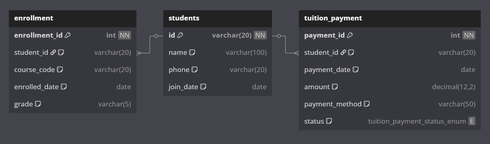

# Janji 
Saya Yusrilia Hidayanti dengan NIM 2306828 mengerjakan Tugas Praktikum 8 dalam mata kuliah Desain dan Pemrograman Berorientasi Objek untuk keberkahanNya maka saya tidak melakukan kecurangan seperti yang telah dispesifikasikan. Aamiin.

# Desain Program


Sistem manajemen data mahasiswa berbasis web dengan arsitektur MVC (Model-View-Controller) yang mengelola data mahasiswa, pendaftaran kursus, dan pembayaran uang kuliah.


## Arsitektur MVC

Aplikasi ini dibangun menggunakan arsitektur Model-View-Controller (MVC) yang memisahkan aplikasi menjadi tiga komponen utama:

1. **Model**: Bertanggung jawab untuk mengelola data, logika, dan aturan aplikasi. Berinteraksi langsung dengan database.
2. **View**: Bertanggung jawab untuk menampilkan data kepada pengguna dan menerima input pengguna.
3. **Controller**: Bertindak sebagai perantara antara Model dan View. Menerima input dari pengguna melalui View, memprosesnya (dengan bantuan Model jika diperlukan), dan mengembalikan output yang sesuai ke View.


## Struktur Folder

```
/
├── config/
│   └── database.php           # Konfigurasi koneksi database
├── models/
│   ├── BaseModel.php          # Kelas dasar untuk semua model
│   ├── Student.php            # Model untuk data mahasiswa
│   ├── Enrollment.php         # Model untuk pendaftaran kursus
│   └── Payment.php     # Model untuk pembayaran uang kuliah
├── views/
│   ├── templates/
│   │   ├── header.php         # Template header untuk semua halaman
│   │   └── footer.php         # Template footer untuk semua halaman
│   ├── students/              # View untuk manajemen mahasiswa
│   │   ├── index.php          # Daftar mahasiswa
│   │   ├── create.php         # Form tambah mahasiswa
│   │   └── edit.php           # Form edit mahasiswa
│   ├── enrollments/           # View untuk manajemen pendaftaran kursus
│   │   ├── index.php          # Daftar pendaftaran
│   │   ├── create.php         # Form tambah pendaftaran
│   │   └── edit.php           # Form edit pendaftaran
│   └── payments/              # View untuk manajemen pembayaran
│       ├── index.php          # Daftar pembayaran
│       ├── create.php         # Form tambah pembayaran
│       └── edit.php           # Form edit pembayaran
├── controllers/
│   ├── BaseController.php     # Kelas dasar untuk semua controller
│   ├── StudentController.php  # Controller untuk manajemen mahasiswa
│   ├── EnrollmentController.php # Controller untuk manajemen pendaftaran
│   └── PaymentController.php  # Controller untuk manajemen pembayaran
├── assets/
│   ├── css/                   # File CSS
│   │   └── bootstrap.min.css  # Bootstrap CSS
│   └── js/                    # File JavaScript
│       └── bootstrap.bundle.min.js # Bootstrap JS
└── index.php                  # Entry point dan router aplikasi
```


# Penjelasan Alur

Berikut adalah alur kerja dasar aplikasi:

1. **Request Masuk**: Pengguna mengakses URL tertentu (misalnya, `index.php?controller=student&action=index`).
2. **Routing**: `index.php` (router) menerima request dan menentukan controller dan action yang sesuai.
3. **Controller Diinisialisasi**: Controller yang sesuai diinisialisasi (misalnya, `StudentController`).
4. **Action Dipanggil**: Method yang sesuai dalam controller dipanggil (misalnya, `index()`).
5. **Model Digunakan**: Controller menggunakan model untuk mengambil atau memanipulasi data (misalnya, `Student->getAll()`).
6. **Data Dikirim ke View**: Controller merender view yang sesuai dan meneruskan data yang diperlukan.
7. **Output Ditampilkan**: View menampilkan data dalam format HTML kepada pengguna.

## Komponen Sistem

### Models

#### BaseModel
- Kelas abstrak yang menyediakan koneksi database dan metode dasar.
- Semua model lain mewarisi dari kelas ini.

#### Student Model
- Mengelola data mahasiswa (CRUD).
- Metode: `getAll()`, `getById()`, `create()`, `update()`, `delete()`, `generateNewId()`.

#### Enrollment Model
- Mengelola data pendaftaran kursus (CRUD).
- Metode: `getAll()`, `getById()`, `create()`, `update()`, `delete()`, `getAllStudents()`, `getCourseCodes()`.

#### Payment Model
- Mengelola data pembayaran uang kuliah (CRUD).
- Metode: `getAll()`, `getById()`, `create()`, `update()`, `delete()`, `getAllStudents()`, `getPaymentMethods()`, `getPaymentStatuses()`.

### Views

#### Templates
- **header.php**: Berisi elemen header HTML dan navigasi.
- **footer.php**: Berisi elemen footer HTML dan script.

#### Student Views
- **index.php**: Menampilkan daftar mahasiswa.
- **create.php**: Form untuk menambahkan mahasiswa baru.
- **edit.php**: Form untuk mengedit data mahasiswa.

#### Enrollment Views
- **index.php**: Menampilkan daftar pendaftaran kursus.
- **create.php**: Form untuk menambahkan pendaftaran baru.
- **edit.php**: Form untuk mengedit pendaftaran.

#### Payment Views
- **index.php**: Menampilkan daftar pembayaran.
- **create.php**: Form untuk menambahkan pembayaran baru.
- **edit.php**: Form untuk mengedit pembayaran.

### Controllers

#### BaseController
- Kelas abstrak yang menyediakan metode dasar untuk semua controller.
- Metode: `render()` untuk merender view, `redirect()` untuk redirect ke URL lain.

#### StudentController
- Menangani request terkait manajemen mahasiswa.
- Actions: `index()`, `create()`, `edit()`, `delete()`.

#### EnrollmentController
- Menangani request terkait manajemen pendaftaran kursus.
- Actions: `index()`, `create()`, `edit()`, `delete()`.

#### PaymentController
- Menangani request terkait manajemen pembayaran.
- Actions: `index()`, `create()`, `edit()`, `delete()`.

## Fitur Aplikasi

1. **Manajemen Mahasiswa**
   - Melihat daftar mahasiswa
   - Menambahkan mahasiswa baru
   - Mengedit data mahasiswa
   - Menghapus mahasiswa

2. **Manajemen Pendaftaran Kursus**
   - Melihat daftar pendaftaran kursus
   - Menambahkan pendaftaran baru
   - Mengedit pendaftaran
   - Menghapus pendaftaran

3. **Manajemen Pembayaran**
   - Melihat daftar pembayaran
   - Menambahkan pembayaran baru
   - Mengedit pembayaran
   - Menghapus pembayaran

## Diagram Alur

### Alur Request-Response

```
+----------+     Request     +------------+     Query      +----------+
|          | --------------> |            | -------------> |          |
| Browser  |                 | Controller |                | Model    |
|          | <-------------- |            | <------------- |          |
+----------+     Response    +------------+     Data       +----------+
                                  |  ^
                                  |  |
                                  v  |
                              +------------+
                              |            |
                              |   View     |
                              |            |
                              +------------+
```

### Alur CRUD

```
+----------+     1. Request     +------------+
|          | -----------------> |            |
| Browser  |                    | Controller |
|          |                    |            |
+----------+                    +------------+
     ^                               |
     |                               | 2. Call Model
     |                               v
     |                          +----------+     3. Query     +----------+
     |                          |          | --------------> |          |
     |                          |  Model   |                 | Database |
     |                          |          | <-------------- |          |
     |                          +----------+     4. Data     +----------+
     |                               |
     |                               | 5. Return Data
     |                               v
     |                          +------------+
     |                          |            |
     |                          |   View     |
     |                          |            |
     |                          +------------+
     |                               |
     |                               | 6. Generate HTML
     |                               v
     |      8. Display      +----------------+
     +-------------------- |                |
                           | HTML Response  |
                           |                |
                           +----------------+
```

## Cara Penggunaan

1. **Akses Aplikasi**
   - Buka browser dan akses URL aplikasi.
   - Halaman default akan menampilkan daftar mahasiswa.

2. **Navigasi**
   - Gunakan menu navigasi di bagian atas untuk beralih antara manajemen mahasiswa, pendaftaran, dan pembayaran.

3. **Manajemen Data**
   - Klik tombol "Add New" untuk menambahkan data baru.
   - Klik tombol "Edit" pada baris data untuk mengedit data.
   - Klik tombol "Delete" pada baris data untuk menghapus data (akan ada konfirmasi).

## Keamanan

1. **Validasi Input**
   - Semua input pengguna divalidasi di sisi server.
   - Menggunakan prepared statements untuk mencegah SQL injection.

2. **Sanitasi Output**
   - Menggunakan `htmlspecialchars()` untuk mencegah XSS (Cross-Site Scripting).

3. **Konfirmasi Aksi Penting**
   - Aksi penghapusan memerlukan konfirmasi pengguna.


# Dokumentasi